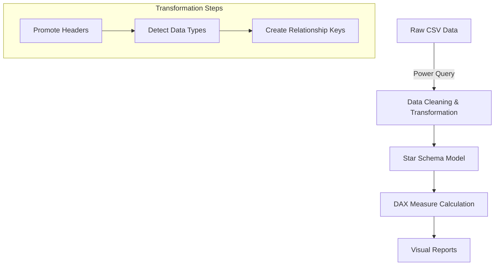
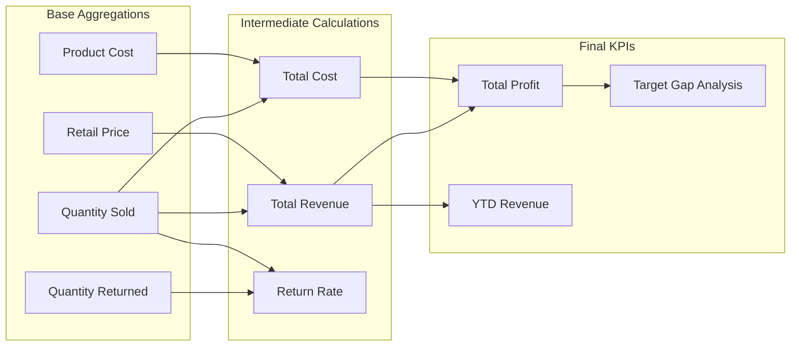
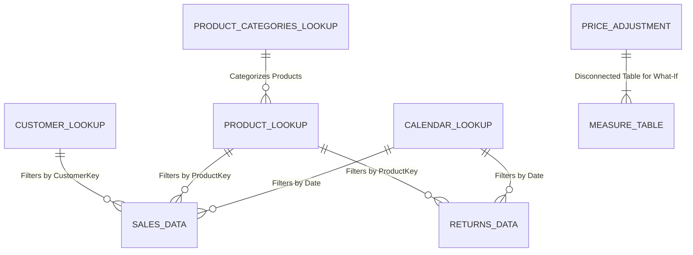

# 🚲 Adventure Works: Global Sales & Returns Dashboard


## 📖 Project Overview

This Power BI project provides a detailed analysis of **Adventure Works**, a global manufacturing company selling cycling equipment across three major continents (North America, Europe, Australia). The report focuses on bridging the gap between high-volume sales and profitability while monitoring return rates to ensure operational efficiency.

The dashboard integrates raw CSV data into a robust **Star Schema** model, utilizing advanced DAX for time intelligence, dynamic target setting, and "What-If" scenario planning.

---

## 💡 Key Insights & Business Questions

This report is designed to answer critical business questions for the Adventure Works leadership team:

- **Profitability vs. Volume:** Which product categories are driving the most revenue vs. the most profit?
- **Return Management:** Are there specific products or regions with high return rates that require operational intervention?
- **Performance Tracking:** Are we currently meeting our 110% growth targets for revenue and orders compared to last month?
- **Market Trends:** How has cycling equipment demand shifted over a 10nday and 90-day rolling period?

## 📱 Dashboard Overview

The report is divided into three primary functional areas:

1. **Executive Summary:** High-level KPIs for Revenue, Profit, and Orders with geographic and category breakdowns.
2. **Product Detail:** Deep dive into specific product performance, return rates, and "What-If" price adjustment simulations.
3. **Customer Detail:** Analysis of individual customer behavior, top spenders, and order frequency.

---

## 🏗️ Data Structure & Modeling

### 🔄 Data Lineage & ETL Workflow



### 🧬 Measure Dependency Lineage

This diagram illustrates how core measures build upon each other to create the final financial indicators found in `Measure_Tables.txt`.



### 🔌 Tech Stack & Connections

- **Power BI Desktop:** The primary visualization and modeling tool.
- [cite_start]**Power Query (M Language):** Used for ETL (Extract, Transform, Load) and to generate the schema-only Measure table.
- **Source Data:** Raw CSV files (`Sales Data`, `Returns Data`, `Customer Lookup`, `Product Lookup`, `Calendar Lookup`, `Product Categories Lookup`).

### 📊 Relationship Diagram (Star Schema)

The data model uses a Star Schema architecture. Dimension (Lookup) tables filter the Fact (Data) tables.



## 🧮 DAX Measures: Detailed Explanation

This project uses a dedicated Measure Table created via M-Code. Below is the breakdown of the logic used, categorized by function.

### 1. 💰 Core Financials (Iterators vs. Aggregators)

**The Challenge:** Revenue and Cost data do not exist in a single column in the source files. The Sales Data table has quantity, but prices live in Product Lookup.
**The Solution:** We use SUMX iterators to calculate row-by-row before summing.

#### Total Cost

- **Formula:** `SUMX('Sales Data', 'Sales Data'[OrderQuantity] * RELATED('Product Lookup'[ProductCost]))`
- **Why/How:** SUMX iterates through every row of the Sales table. RELATED fetches the cost from the Product table for that specific row.

#### Total Revenue

- **Formula:** `SUMX('Sales Data', 'Sales Data'[OrderQuantity] * RELATED('Product Lookup'[Discount Price]))`
- **Why:** Ensures discounts and specific product prices are applied accurately at the transaction level.

#### Total Profit

- **Formula:** `[Total Revenue] - [Total Cost]`

### 2. ↩️ Returns Analysis & Category Isolation

**The Challenge:** We need to see global returns, but also specifically isolate "Bikes" as they are high-value items.
**The Solution:** CALCULATE is used to override filter context.

#### Return Rate

- **Formula:** `DIVIDE([Quantity Returned], [Quantity Sold], "No Sales")`
- **Why:** DIVIDE is safer than the / operator because it handles division-by-zero errors automatically.

#### Bike Returns

- **Formula:** `CALCULATE([Total Returns], 'Product Categories Lookup'[CategoryName] = "Bikes")`
- **How:** This measure ignores other filters on category and forces the calculation to look only at "Bikes".

#### % of All Returns

- **Formula:** `DIVIDE([Total Returns], [All Returns])` where `[All Returns]` uses `CALCULATE(..., ALL('Returns Data'))`.
- **Why:** The ALL function removes all filters from the returns table, providing a grand total denominator to calculate the percentage share.

### 3. 📅 Time Intelligence (Trends & Rolling Averages)

**The Challenge:** Sales are volatile. We need to compare performance against the previous month and smooth out daily noise.
**The Solution:** DAX Time Intelligence functions.

#### Previous Month Metrics

- **Formula:** `CALCULATE([Total Revenue], DATEADD('Calendar Lookup'[Date], -1, MONTH))`
- **Why:** DATEADD shifts the date context back exactly one month, allowing for MoM (Month-over-Month) comparison columns.

#### 90-Day Rolling Profit

- **Formula:** `CALCULATE([Total Profit], DATESINPERIOD('Calendar Lookup'[Date], MAX('Calendar Lookup'[Date]), -90, DAY))`
- **How:** DATESINPERIOD creates a dynamic window of the last 90 days from the current date in the visual context, smoothing out short-term fluctuations.

#### 10-Day Rolling Revenue

- **Formula:** `CALCULATE([Total Revenue], DATESINPERIOD('Calendar Lookup'[Date], MAX('Calendar Lookup'[Date]), -10, DAY))`
- **Purpose:** Provides a short-term trend view to identify immediate sales spikes or dips.

#### YTD Revenue

- **Formula:** `CALCULATE([Total Revenue], DATESYTD('Calendar Lookup'[Date]))`
- **Why:** Tracks cumulative performance from the beginning of the fiscal year to monitor progress against annual goals.

### 4. 🎯 Dynamic Targets & Gaps

**The Challenge:** Static goals become obsolete quickly.
**The Solution:** Programmatic targets based on recent performance.

**Logic:** The target is set to 110% (1.1 multiplier) of the previous month's performance.

- **Revenue Target:** `[Previous Month Revenue] * 1.1`
- **Order Target:** `[Previous Month Orders] * 1.1`

#### Target Gaps

- **Formula:** `[Total Revenue] - [Revenue Target]`
- **How It Works:** Compares actual performance against the 110% growth metric.
- **Usage:** Used in KPI cards and bullet charts to provide instant visual feedback on whether a specific category or region is "In the Red".
- **Metrics Included:** `Revenue Target Gap`, `Order target Gap`, and `Profit Target Gap`.

### 5. 👤 Customer Detail Logic

**The Challenge:** We want to show customer names in a list, but prevent the measure from calculating a "Total" name at the bottom of a table.
**The Solution:** HASONEVALUE.

#### Full Name (Customer Detail)

- **Formula:** `IF(HASONEVALUE('Customer Lookup'[CustomerKey]), MAX('Customer Lookup'[Full Name]), "Multiple Customers")`
- **Why:** If the visual row represents one customer, show their name. If it's the "Total" row (which represents many customers), display "Multiple Customers" or a blank dash.

### 6. 🔮 What-If Scenario (Price Adjustment)

**The Challenge:** Stakeholders want to simulate: "What happens to profit if we raise prices by 5%?"
**The Solution:** A disconnected parameter table.

- **Adjusted Price:** `[Average Retail Price] * (1 + 'Price Adjustment'[Price Adjustment Value])`
- **Adjusted Revenue:** Re-runs the SUMX logic using `[Adjusted Price]` instead of the standard price.
- **Impact:** This allows users to use a slicer to dynamically update financial projections without altering the underlying data.

## 🛠️ Technical Implementation Details

### The M-Table Hack

Instead of a standard calculated table, the Measure Table was generated using M-Language binary decompression:

```powerquery
Source = Table.FromRows(Json.Document(Binary.Decompress(Binary.FromText("i44FAA==", ...
```

**Why?** This creates a table with no data source dependencies, strictly for housing measures, keeping the field list clean.

### Formatting

- **Currency:** All monetary values are formatted with en-US culture hints ($#,0.00).
- **Handling Nulls:** Measures like Total Orders (Customer Detail) return "-" if multiple values exist, ensuring clean visual tables.

## 🚀 How to Run

1. **Download:** Ensure all .csv files and the .pbix are in the same folder structure.
2. **Connections:** Open Power BI > Transform Data > Data Source Settings > Change Source to your local directory.
3. **Refresh:** Click "Refresh" to load the latest data from the CSVs.

---

## 📂 Project Structure

```text
.
├── AdventureWorks Report.pbix    # Main Power BI Report File
├── Measure_Tables.txt            # Raw DAX Measure Export
├── README.md                     # Documentation
└── .git                          # Version Control
```

## 📸 Visual Highlights

> [!NOTE]
> Add dashboard screenshots here to showcase the UI design and key visuals.

### Executive Summary

_(Insert screenshot of Executive Summary page)_

### Product Detail & What-If Analysis

_(Insert screenshot of Product Detail page showing the Price Adjustment slicer)_

### Customer Analysis

_(Insert screenshot of Customer Detail page)_
